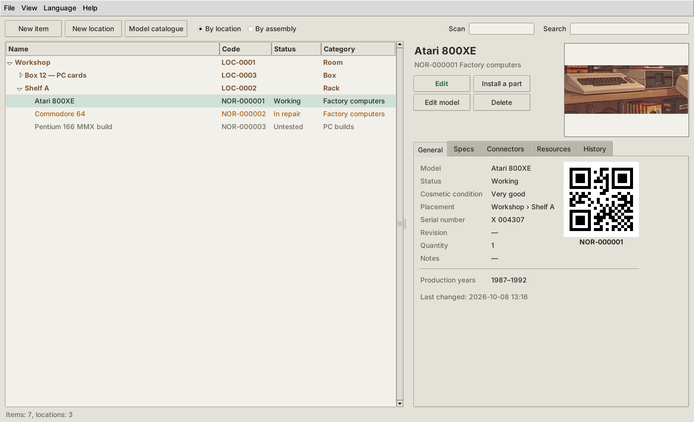
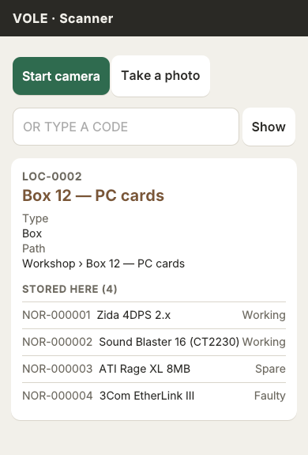
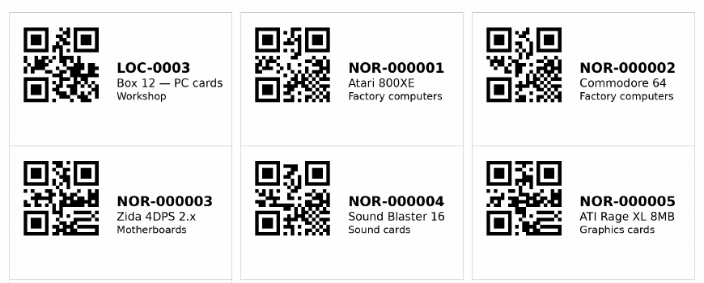
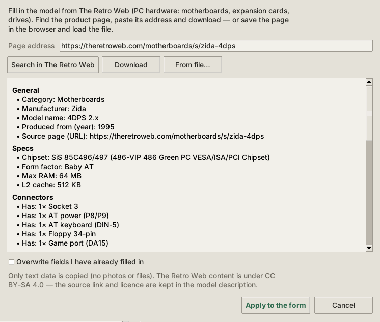

# NORNICA / VOLE

**Katalog domowej kolekcji sprzętu retro** — komputery fabryczne, składaki PC,
części i akcesoria. Gdzie co leży, co jest w środku, co działa, a co czeka
na naprawę.

Interfejs po polsku (**NORNICA**) lub angielsku (**VOLE**), przełączany
w trakcie pracy programu.

[English README](README.md)

## Możliwości

- **Egzemplarze i lokalizacje w drzewie** — pokoje, regały, półki, pudełka;
  widok według miejsca albo według zestawów.
- **Zestawy** — składak PC to egzemplarz złożony z innych egzemplarzy (płyta,
  karty, napędy); montaż i demontaż części, historia testów i napraw.
- **Katalog modeli** — producent, lata produkcji, parametry zależne od
  kategorii (chipset, RAM, pojemność…) i złącza (co urządzenie ma, czego wymaga).
- **Własne kategorie, pola i statusy** — pola tekstowe, liczbowe, tak/nie,
  listy wyboru i pojemności w dowolnej kategorii; podkategorie je dziedziczą.
  Wpisy wbudowane są tylko do odczytu, a usuwanie jest chronione.
- **Etykiety z kodami QR** — każdy egzemplarz i lokalizacja ma kod
  (`NOR-000001`, `LOC-0001`); arkusze A4 (Avery) albo etykiety na drukarki
  Brother / Dymo, jako PDF lub PNG.
- **Telefon jako skaner** — program uruchamia lokalny serwer HTTPS i pokazuje
  kod QR; telefon otwiera stronę w przeglądarce (bez instalowania aplikacji),
  skanuje etykiety kamerą na żywo i dodaje zdjęcia. Android i iPhone.
- **Czytniki kodów USB / Bluetooth** — pole „Skanuj” na pasku (F2).
- **Dane z The Retro Web** — uzupełnienie modelu sprzętu PC (płyty główne,
  karty rozszerzeń, napędy) z serwisu [The Retro Web](https://theretroweb.com):
  najpierw podgląd, potem wpisanie do formularza. Tylko dane tekstowe,
  licencja CC BY-SA 4.0, źródło zostaje w opisie.
- **Zdjęcia, dokumenty i odnośniki** dla egzemplarzy i modeli.
- **Porządki w kolekcji** — pliki bez powiązań i bez wpisu, puste lokalizacje,
  nieużywane modele i producenci, egzemplarze bez miejsca i powtórzone numery
  seryjne; nic nie znika bez Twojego potwierdzenia.
- **Eksport** — `.xlsx`, `.xls`, `.csv`, `.html`.
- **Bezpieczne dane** — SQLite, atomowe migracje schematu z sumami
  kontrolnymi i automatyczną kopią zapasową przed każdą aktualizacją.

| Skaner w telefonie | Arkusz etykiet | The Retro Web |
|---|---|---|
|  |  |  |

## Wymagania

Python 3.10+ z tkinterem, SQLite 3.35+ z obsługą JSON (standard w obecnych
wydaniach Pythona).

**Arch Linux**

    sudo pacman -S python tk python-pillow python-qrcode python-reportlab python-openpyxl python-cryptography
    pip install --user xlwt          # opcjonalnie, eksport do starego .xls

Pakiet `tk` jest potrzebny dla tkintera — w Arch nie instaluje się razem
z Pythonem.

**Debian / Ubuntu**

    sudo apt install python3 python3-tk
    pip install -r requirements.txt

**Windows 10/11** — instalator z python.org z zaznaczoną opcją „tcl/tk and
IDLE”, potem

    pip install -r requirements.txt

Każda biblioteka jest opcjonalna: bez niej program działa, wyłączona jest
tylko odpowiednia funkcja (z komunikatem dlaczego).

## Uruchomienie

    python nornica.py                  # okno programu
    python nornica.py --jezyk pl       # wybór języka (zapamiętywany)
    python nornica.py --bez-powitania  # bez ekranu powitalnego
    python nornica.py --konsola        # tylko przygotowanie bazy i podsumowanie

## Gdzie są Twoje dane

Baza, kopie zapasowe, zdjęcia i certyfikaty **nigdy nie trafiają do folderu
z kodem**:

- Linux: `~/.local/share/nornica/`
- Windows: `%APPDATA%\Nornica\`

Inne miejsce: zmienna środowiskowa `NORNICA_DANE` albo `--baza ŚCIEŻKA`.
Dzięki temu repozytorium zostaje czyste — `.gitignore` dodatkowo blokuje
pliki baz, kopie i klucze na wypadek, gdyby ktoś wskazał folder danych tutaj.

Przy każdym starcie program sam aktualizuje schemat bazy (z kopią zapasową
w `kopie/` w folderze danych).

## Testy

    pip install -r requirements-dev.txt
    xvfb-run -a -s "-screen 0 1920x1080x24" python -m unittest discover -s testy -t .

Około 360 testów: baza, migracje, reguły biznesowe, zgodność kluczy
tłumaczeń (EN/PL), etykiety PDF (odczytywane z powrotem przez zbar), serwer
dla telefonu, parser The Retro Web (na zapisanych stronach) i interfejs.
Bez ekranu testy interfejsu są pomijane. GitHub Actions uruchamia je przy
każdym pushu.

## Grafika

Ikony i obrazek „brak zdjęcia” w `zasoby/` są wygenerowane z ilustracji
`zasoby/zrodlo/nornica.jpeg` skryptem `narzedzia/generuj_grafiki.py`
(wymaga Pillow). Ekran powitalny `zasoby/powitanie.png` jest przygotowany
ręcznie i skrypt go nie nadpisuje (chyba że z opcją `--powitanie`). Program
czyta gotowe pliki PNG, więc do startu Pillow nie jest potrzebne.

## Struktura

    nornica.py           punkt startowy
    konfiguracja.py      ścieżki danych zależne od systemu
    wyjatki.py           wyjątki niosące klucze tłumaczeń
    baza/                SQLite: migracje schematu, połączenie, repozytoria, dane startowe
    uslugi/              reguły biznesowe: inwentarz, etykiety, eksport, serwer skanera, The Retro Web
    gui/                 okna tkinter
    raporty/             eksport do plików
    i18n/                tlumacz.py, en.json, pl.json
    zasoby/              ikony, ekran powitalny, strona dla telefonu (jsQR)
    testy/               testy i dane testowe
    narzedzia/           skrypty deweloperskie
    docs/zrzuty/         zrzuty ekranu do README

## Licencja

Copyright © 2026 Rafał Zacharski

Ten program jest wolnym oprogramowaniem: możesz go rozpowszechniać i/lub
modyfikować na warunkach Powszechnej Licencji Publicznej GNU (GNU GPL)
w wersji 3 lub (według Twojego wyboru) dowolnej późniejszej, opublikowanej
przez Free Software Foundation.

Program jest rozpowszechniany w nadziei, że będzie użyteczny, ale BEZ
JAKIEJKOLWIEK GWARANCJI. Szczegóły w pliku [`LICENSE`](LICENSE).

Wszystkie pliki w repozytorium są objęte tą licencją, o ile nie zaznaczono
inaczej. Wyjątki: biblioteka jsQR (Apache-2.0, `zasoby/www/`) oraz
ilustracja i nazwa projektu ([`zasoby/GRAFIKA.md`](zasoby/GRAFIKA.md)).
Licencje komponentów zewnętrznych:
[`THIRD_PARTY_NOTICES.md`](THIRD_PARTY_NOTICES.md).

Pliki migracji w `baza/schemat/` celowo nie mają nagłówka licencji: ich sumy
kontrolne są zapisane w bazach użytkowników, a strażnik migracji odmawia
pracy po zmianie zastosowanego pliku. Obejmuje je oświadczenie powyżej.
